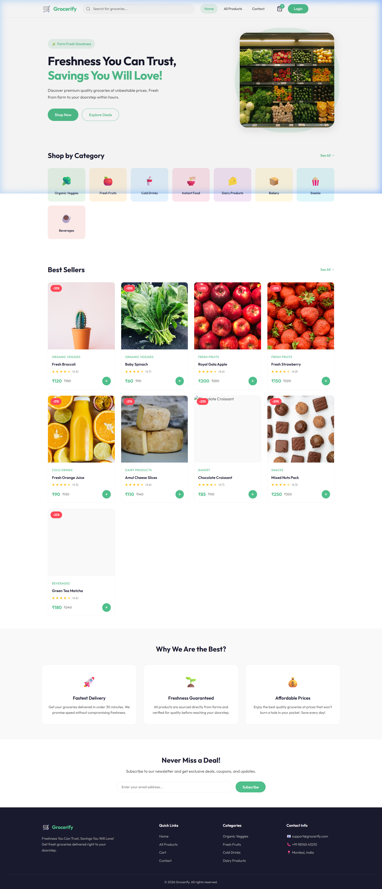
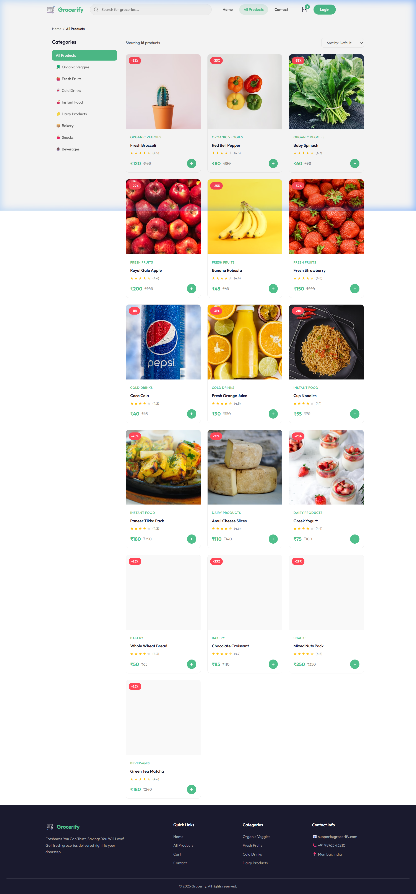
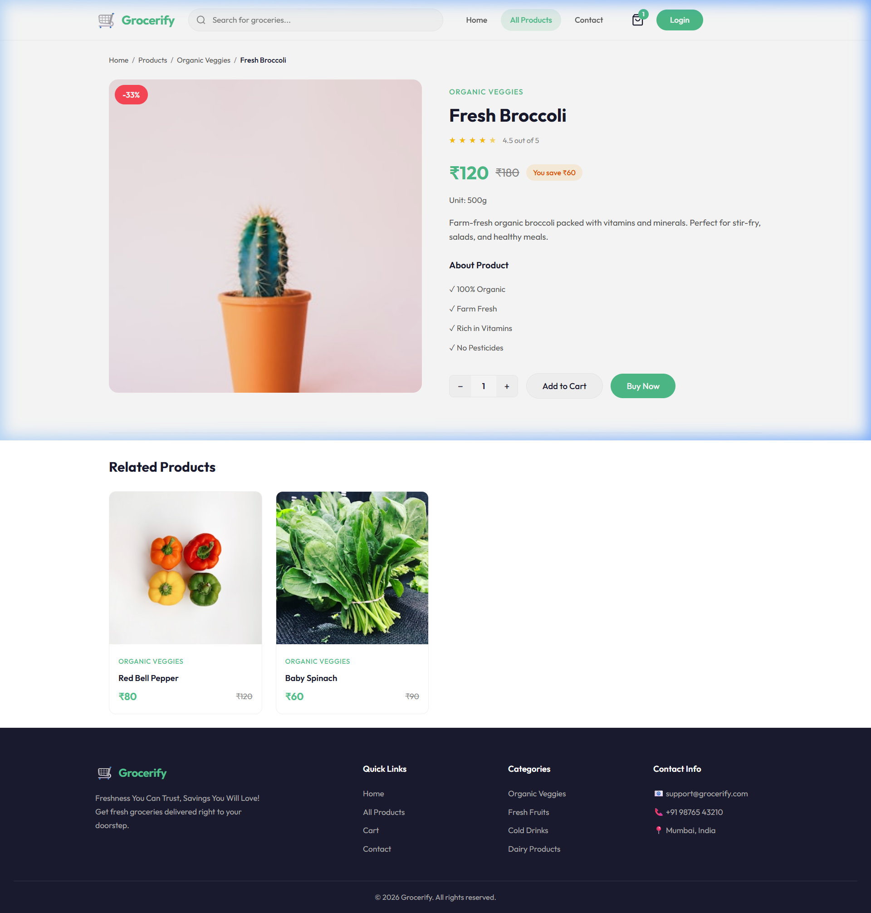
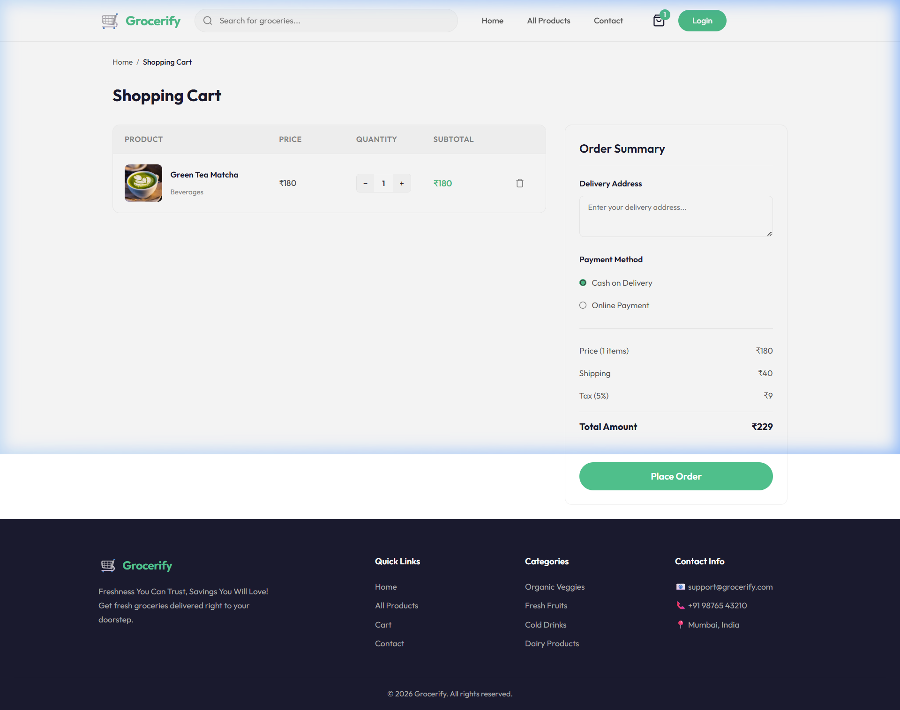

# 🛒 Grocerify

<div align="center">

**A modern, full-featured grocery shopping web application**  
*Built with React + Vite • Inspired by GreenCart*

[](https://react.dev/)
[](https://vite.dev/)
[](https://reactrouter.com/)
[](https://developer.mozilla.org/en-US/docs/Web/CSS)

</div>

---

## 📸 Screenshots

### 🏠 Home Page
> Hero banner, category grid, best sellers, features section, newsletter & footer



---

### 🛍️ All Products Page
> Filterable product grid with category sidebar, sort options, product cards with discount badges



---

### 📦 Product Detail Page
> Full product info, rating, price with savings, add to cart / buy now, related products



---

### 🛒 Shopping Cart
> Cart items list, quantity controls, order summary with tax/shipping breakdown, payment method selection, place order



---

## ✨ Features

| Feature | Description |
|---|---|
| 🏠 **Hero Section** | Animated banner with shop now & explore deals CTAs |
| 📂 **8 Categories** | Organic Veggies, Fresh Fruits, Cold Drinks, Instant Food, Dairy, Bakery, Snacks, Beverages |
| 🃏 **Product Cards** | Discount badges, star ratings, original/sale price, add to cart button |
| 🔍 **Search** | Live search bar in the navbar |
| 🧭 **Category Filter** | Sidebar filter on the All Products page |
| 📊 **Sort** | Sort products by default, price low/high, rating |
| 📄 **Product Detail** | Full page with unit, description, feature bullets, related products |
| 🛒 **Shopping Cart** | Add/remove items, quantity +/-, real-time order total |
| 💳 **Order Summary** | Price, shipping, 5% tax breakdown, delivery address, payment method |
| 📧 **Newsletter** | Email subscription section |
| 📞 **Contact Page** | Contact form with email, phone, address |
| 📱 **Responsive** | Mobile-first fully responsive layout |
| 🎨 **Modern UI** | Outfit font, `#4DB6AC` green palette, smooth hover animations |

---

## 🏗️ Tech Stack

| Layer | Technology |
|---|---|
| **Frontend Framework** | React 19 |
| **Build Tool** | Vite 8 |
| **Routing** | React Router v7 |
| **State Management** | React Context API (cart state) |
| **Styling** | Vanilla CSS3 with custom design tokens |
| **Icons** | React Icons |
| **Notifications** | React Toastify |
| **HTTP Client** | Axios |
| **Font** | Outfit (Google Fonts) |

---

## 🚀 Getting Started

### Prerequisites
- Node.js 18+ installed
- npm or yarn

### Installation & Run

```bash
# Clone the repo
git clone https://github.com/PandeyjiOP0502/Grocerify.git
cd Grocerify

# Install client dependencies
cd client
npm install

# Start the development server
npm run dev
```

The app will be running at **http://localhost:5173**

---

## 📁 Project Structure

```
Grocerify/
├── client/                    # React frontend
│   ├── src/
│   │   ├── assets/            # Images, product data (assets.js)
│   │   ├── components/
│   │   │   ├── Navbar.jsx     # Top navigation with search & cart
│   │   │   ├── ProductCard.jsx # Reusable product card component
│   │   │   └── Footer.jsx     # 4-column footer
│   │   ├── context/
│   │   │   └── AppContext.jsx  # Cart state & global context
│   │   ├── pages/
│   │   │   ├── Home.jsx       # Landing page
│   │   │   ├── Products.jsx   # All products with filters
│   │   │   ├── ProductDetail.jsx # Single product view
│   │   │   ├── Cart.jsx       # Shopping cart & checkout
│   │   │   └── Contact.jsx    # Contact form
│   │   ├── App.jsx            # Router setup
│   │   ├── index.css          # Global styles & design system
│   │   └── main.jsx           # App entry point
│   ├── index.html
│   ├── package.json
│   └── vite.config.js
├── server/                    # Express backend (coming soon)
│   ├── configs/
│   ├── controllers/
│   ├── models/
│   └── routes/
├── screenshots/               # App screenshots for README
└── README.md
```

---

## 📄 Pages Overview

### `/` — Home
- **Hero**: "Freshness You Can Trust, Savings You Will Love!" with grocery shelf image
- **Categories**: 8 category chips (Organic Veggies, Fresh Fruits, Cold Drinks, Instant Food, Dairy Products, Bakery, Snacks, Beverages)
- **Best Sellers**: 9-product grid with discount badges and star ratings
- **Why Us**: 3 feature cards — Fastest Delivery, Freshness Guaranteed, Affordable Prices
- **Newsletter**: Email subscription box
- **Footer**: Logo, quick links, category links, contact info

### `/products` — All Products
- Left sidebar with category filter (All + 8 categories)
- Sort dropdown (Default, Price Low-High, Price High-Low, Rating)
- Product count display
- Responsive 3-column product grid

### `/products/:id` — Product Detail
- Large product image with discount badge
- Category, name, star rating
- Sale price, original MRP, savings badge
- Unit info, description, feature list
- Quantity selector + Add to Cart + Buy Now buttons
- Related products section

### `/cart` — Shopping Cart
- Product list with image, name, category, unit price, quantity controls, subtotal, remove button
- Order Summary sidebar with delivery address input, payment method (COD / Online), price breakdown (items, ₹40 shipping, 5% tax), total, Place Order button

### `/contact` — Contact
- Contact form (name, email, subject, message)
- Contact details card (email, phone, address)

---

## 🎨 Design System

| Token | Value |
|---|---|
| **Primary Green** | `#4DB6AC` |
| **Dark Green** | `#00897B` |
| **Font** | Outfit (Google Fonts) |
| **Border Radius** | `12px` cards, `999px` buttons |
| **Shadow** | `0 4px 20px rgba(0,0,0,0.08)` |

---

## 🔮 Roadmap

- [ ] Backend API with Express + MongoDB
- [ ] User authentication (login / register)
- [ ] Order history page
- [ ] Admin seller dashboard
- [ ] Payment gateway integration
- [ ] Product reviews & ratings

---

## 📜 License

MIT © 2026 Grocerify

---

<div align="center">
Made with ❤️ by <a href="https://github.com/PandeyjiOP0502">PandeyjiOP0502</a>
</div>
